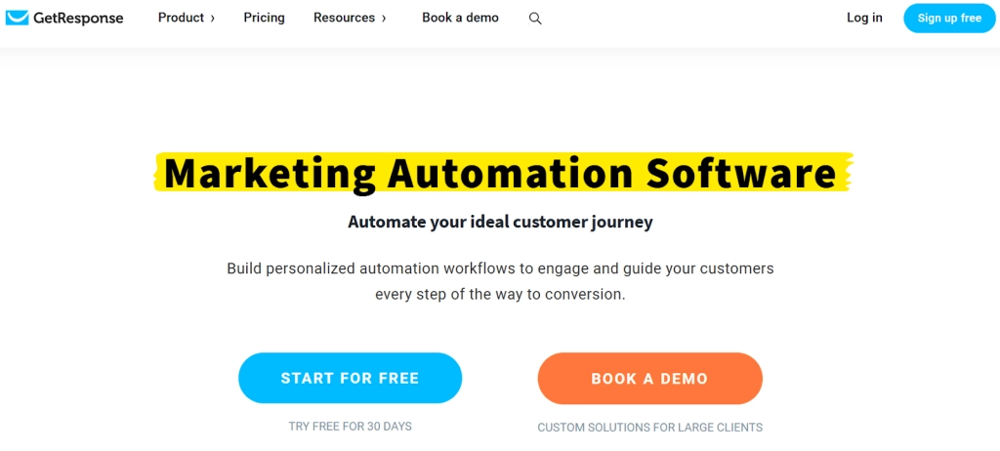

# 2025年最值得CMO关注的营销自动化工具

做营销的人都懂，那些重复性的手动操作真的很烦。发邮件、排社交媒体内容、追踪线索……每天光是这些事就能把人累个半死。好消息是，现在有一堆营销自动化工具可以帮你把这些活儿扔给机器，你只需要专心想策略就行了。

这篇文章就是帮你找到合适工具的——不管你是想自动化邮件营销、社交媒体发布，还是SEO优化，这里都有对应的工具推荐。而且我还会告诉你每个工具的价格和优惠信息，让你花更少的钱办更多的事。

---

## 营销自动化软件该有哪些功能?

营销自动化工具能干的事挺多的——SEO、社交媒体、邮件营销、个性化推荐……五花八门。下面是一些最常见的功能:

1. **邮件营销自动化**: 根据用户行为(比如注册、购买、放弃购物车)自动发送个性化邮件
2. **社交媒体管理**: 定时发布社交媒体内容,追踪点赞、评论、分享等数据
3. **潜在客户生成和评分**: 根据用户在网站、邮件等渠道的互动来追踪和优先处理线索
4. **落地页创建**: 创建和优化转化率高的落地页,还能做A/B测试看哪个版本效果更好
5. **客户分群**: 根据人口统计、行为、购买历史等标准给客户分组,然后针对不同组发送不同的内容
6. **个性化**: 利用客户数据创建定制化体验,比如个性化网站内容、产品推荐等
7. **分析和报告**: 通过详细的数据分析和报告来衡量营销效果,包括实时追踪和历史数据
8. **SEO自动化**: 通过关键词研究、元标签生成、Google搜索结果数据提取、死链检查等自动化任务来优化网站。这能提高你的搜索引擎排名,给网站带来更多自然流量

👉 [想快速提升数据采集效率?点击了解ScraperAPI如何帮你轻松获取SERP数据](https://www.scraperapi.com/?fp_ref=coupons)

---

## 全能型营销自动化工具

这部分介绍的工具基本上什么都能干一点。用它们可以自动化各种营销活动,给访客提供个性化的自动体验。

### User.com

User.com是个全能型营销自动化软件,能帮你优化销售漏斗的每个环节。你可以用它追踪网站访客的行为,然后用这些数据提供个性化的客户旅程。轻松构建工作流,在访客做特定动作时自动触发。分群管理受众、追踪产品互动、推荐产品、发送邮件活动、添加在线聊天、使用网页推送通知、显示弹窗……功能多到数不过来。

而且,你和潜在客户、现有客户的所有互动都会自动同步到内置的CRM里。

**User.com定价**

User.com的网站上没直接显示价格。想要定制报价,需要联系他们的销售团队。

### ActiveCampaign

ActiveCampaign是个客户关系管理(CRM)和营销自动化软件。它帮企业管理和自动化销售、营销和客户服务工作。功能包括邮件营销、自动化、线索评分、销售管道管理,还有CRM数据库。它还能和其他工具集成,比如电商平台、网页表单、社交媒体。用ActiveCampaign,你可以自动化重复性任务、个性化客户沟通,还能深入了解客户行为。

**ActiveCampaign定价**

- 14天免费试用
- Lite: 每月$29
- Plus: 每月$49
- Professional: 每月$149
- Enterprise: 定制定价

### EngageBay

EngageBay是个CRM,帮企业自动化和简化销售与营销流程。作为最好的全能型营销自动化软件和CRM之一,你可以轻松分群受众、构建自动化工作流、创建落地页、发送邮件、使用在线聊天、管理社交媒体等等。然后,所有这些客户互动都会存储在你的CRM里。这样营销团队可以吸引更多潜在客户,销售代表可以在同一个平台上把他们转化成交易。

所以如果你想创建高级营销活动并自动化繁琐任务,一定要看看这个工具。

**EngageBay定价**

以下是EngageBay提供的营销计划:

- Free: 每月$0
- Basic: 每月$12.99
- Growth: 每月$49.99
- Pro: 每月$79.99

### Emitrr

Emitrr是个全能型营销和通讯软件,可以通过短信和邮件开展营销活动。这个软件有滴灌营销活动、短信和邮件自动化、模板、个性化、AI集成等功能。

最棒的是,Emitrr能无缝集成1000多种外部工具和CRM软件,所以你可以自动同步客户信息到Emitrr的仪表板。这个强大的软件还有其他客户沟通功能,比如VoIP、预约安排、评价和声誉管理,你可以把这些添加到套餐里实现完整的业务管理。

**Emitrr定价**

Emitrr提供定制和灵活的定价计划,起价仅每月$149。

---

## 社交媒体自动化工具

用这些工具,你可以优化和自动化社交媒体管理。从社交媒体定时发布到LinkedIn外联活动都能搞定。

### PhantomBuster

PhantomBuster是你能用来自动化远不止社交媒体的最佳营销自动化软件之一。这个平台给你提供一系列无代码自动化工具,可以从大多数网站抓取数据、发帖、关注新用户、发送个性化外联等等。PhantomBuster为Twitter、LinkedIn、Instagram、Reddit等社交媒体提供的一些机器人和任务包括:

- 自动点赞
- 自动关注
- 话题标签搜索导出
- 消息发送器
- 个人资料抓取器
- 媒体提取器
- 搜索转潜在客户连接
- 自动评论
- 自动取消关注

**PhantomBuster定价**

- 14天免费试用
- Starter: 每月$59
- Pro: 每月$139
- Team: 每月$399

### Castanet

Castanet是个LinkedIn自动化软件,让你的销售团队可以自动化个性化外联序列。你可以基于Sales Navigator搜索、帖子互动或手动个性化消息给关注者来做序列。有了这个LinkedIn自动化工具,很容易就能连接你的职业网络并触达成千上万的新潜在客户。Castanet是代理机构、SaaS公司、房地产经纪人、投资者或任何其他类型销售团队的最佳LinkedIn自动化工具之一。

**Castanet定价**

- 7天免费试用
- Sales Pro: 每月$199
- Small Team/Agency: 每月$499
- Enterprise: 定制定价

### SocialPilot

SocialPilot是个综合性社交媒体管理工具,专为企业和代理机构设计,用于自动化和简化社交媒体任务。它帮你在多个平台(包括Facebook、Instagram、Twitter、LinkedIn等)上安排、发布和分析帖子。凭借团队协作、内容策划和分析等强大功能,SocialPilot让你能够简化社交媒体策略并更有效地吸引受众。一些关键功能包括:

- 批量安排
- 社交媒体分析
- 内容策划
- 帖子规划器
- 自动发布
- 团队协作
- 客户管理
- 社交媒体报告
- 内容日历

**SocialPilot定价**

从14天免费试用开始你的SocialPilot之旅。

- Standard: 每月$30
- Premium: 每月$50
- Enterprise: 每月$100
- Ultimate: 每月$200

### Publer

Publer是个社交媒体自动化工具,可以让你提前为Facebook、Instagram、TikTok、Twitter、LinkedIn、Pinterest、Google、YouTube、WordPress和Telegram安排帖子。其他社交媒体营销自动化工具通常不支持这么多社交网络。Publer给你一个直观的平台来安排帖子、协作项目、追踪结果、自动化RSS发布,轻松优化你的策略。这个Instagram自动化工具的一个关键功能是优化"个人简介中的链接"。有了这个功能,你可以在简介中添加一个显示多达15个链接的落地页。这样你就可以在Instagram上推广你业务的其他部分了。

**Publer定价**

- Free: 每月$0
- Professional: 每月$12
- Business: 每月$21

### Pronto

Pronto是个为小企业设计的视频自动化工具。通常小企业主没有资源创建高质量视频内容,所以他们就放弃了这个想法。有了Pronto,你可以在不到60秒内得到你的商业视频,不需要任何视频编辑经验。你只需要告诉Pronto你的项目,上传你的素材,选择几个样式选项。然后,你就会有一个专业视频,你可以随心所欲地调整。

**Pronto定价**

- Business: 每月$199
- Business Plus: 每月$899
- Enterprise或White Label: 定制定价

### Wiza

Wiza是个值得信赖的LinkedIn潜在客户开发工具,帮企业生成线索和建立客户基础。凭借其先进的算法和强大功能,它可以快速高效地从LinkedIn提取数据,包括联系信息、职位、公司名称等。这个工具对于依赖B2B销售并需要在特定行业或地区识别潜在客户的企业特别方便。Wiza以其准确性、易用性和可靠的客户支持而闻名,使其成为希望简化潜在客户开发流程并改善销售成果的企业的首选。

**Wiza定价**

- Micro: 每月$30
- Pro: 每月$50
- Growth: 每月$100

### Affable.ai

有了这个网红营销工具,你可以让寻找创作者变得轻松多了。Affable有个易于使用的搜索引擎,拥有超过700万个创作者账户和20多个过滤器,可以尽可能缩小你的搜索范围。一旦你找到合适的网红,你就可以通过内置CRM轻松管理整个合作。给你的网红发送产品、追踪联盟销售、导出内容以便再利用、创建报告等等。

**Affable.ai定价**

Affable提供3个灵活的付费计划和免费试用。要获取每个计划的成本更多信息,你需要联系Affable销售团队。

---

## 邮件营销自动化工具

邮件是使用最多的渠道之一,也是最需要自动化的地方。有了这些邮件自动化工具,你可以把外联策略提升到新水平,而不用做手动任务。

### GetResponse

GetResponse是个强大的营销自动化软件,让你可以在客户旅程的每一步构建个性化自动化工作流。

有了GetResponse,你可以基于无限数量的标签构建个人联系人档案,监控他们的参与度分数,并使用这些行为数据设置基于预定义条件触发的营销自动化规则。

GetResponse营销自动化工具非常适合培养新注册用户、根据订阅者的喜好推荐热门产品、挽回流失销售和放弃的购物车,以及其他基于行为的邮件定向营销活动。

**GetResponse定价**

定价从年度Starter计划的€13.12/月起,提供30天完整试用。

### Drip

Drip是个营销自动化工具,使用邮件和网站消息以更少的手动工作转化更多客户。有了这个邮件自动化软件,你可以创建自动运行的工作流。而且有了预构建的工作流,开始自动化你的营销活动就更容易了。为欢迎客户、放弃购物车、购买后、生日等创建工作流。

Drip还有高级分群功能,所以你可以以最好的方式与人们互动。另外,你还可以创建表单和弹窗,这有助于优化你漏斗的早期阶段。

**Drip定价**

定价从每月$39起,最多2,500个联系人。Drip提供14天免费试用。

### Encharge

Encharge是个高级云端邮件自动化工具,你可以用它根据人们在你网站上的行为向他们发送营销活动。例如,你可以设置一个触发器,这样当有人从你的网站下载电子书时,他们会自动注册到一个邮件序列中。如果你想根据客户的行为为他们提供个性化旅程,这非常有帮助。另外,你可以将Encharge与其他商业工具(如Segment、Stripe、Twilio和Intercom)集成,构建更加个性化的体验。

**Encharge定价**

定价从每月$99起,最多2,000个联系人。Encharge提供14天免费试用。

### Moosend

Moosend是另一个具有强大功能和易用界面的邮件自动化软件。有了这个工具,你可以用拖放构建器设计邮件模板、创建落地页,并使用触发器自动化邮件营销活动。这样你就可以创建更快转化客户的个性化旅程。

**Moosend定价**

定价从每月$9起,最多500个联系人。Moosend提供30天免费试用。

### Folderly

Folderly是个AI邮件自动化工具,旨在确保你的邮件远离垃圾邮件文件夹。你可以用它轻松识别让邮件进入垃圾邮件文件夹的问题。然后,通过AI和自动化,你可以快速修复这些问题。一旦一切都解决了,你可以使用这个平台追踪邮件性能和送达率。所以,如果出现任何新问题,你可以立即识别并更改它。根据Folderly网站,用户报告使用该平台后打开率和参与率提高了60%。

**Folderly定价**

Folderly Core: 每个邮箱每月$200

### CopyFactory

CopyFactory是当今可用的最佳销售和营销邮件自动化工具之一。通过AI,它能够为邮件、LinkedIn消息或任何其他类型的销售或营销内容生成文案。另外,这个销售自动化工具使用个性化来制作更有效地与潜在客户建立联系的消息。最后,你还可以访问AI模板,让你的销售开发代表的工作更加轻松。

**CopyFactory定价**

- Free: 每月$0
- Grow: 每月$59
- Scale: 每月$99

### Sanebox

大多数邮件收件箱都充斥着各种各样的消息。它到了这样的地步:我们的收件箱饱和了,让真正重要的邮件被忽略了。Sanebox是这个问题的AI驱动解决方案。屏蔽干扰、暂停邮件、获取提醒、追踪回复、从邮件列表中退订,并确保重要邮件始终保持在你的收件箱顶部。你可以稍后查看所有其他邮件。

**Sanebox定价**

- Appetizer: 7¢/天
- Snack: 每月$9
- Lunch: 每月$12
- Dinner: 每月$36

### VerifiedEmail

虽然VerifiedEmail不是营销自动化工具,但它在确保你的自动化营销活动发挥最佳性能方面起着至关重要的作用。干净的邮件列表是任何成功营销自动化策略的基础,而VerifiedEmail让这个过程变得轻而易举。

凭借其实时验证技术和批量邮件列表清理,VerifiedEmail在你启动营销活动之前会删除无效、重复、一次性和有风险的地址。这有助于保护你的发件人声誉、提高送达率并最大化参与率——这样你的自动化工作流触发的邮件实际上能到达收件箱。

**VerifiedEmail定价**

提供200个信用额度的免费试用。付费计划从$7起,可验证1,000封邮件,采用灵活的按需付费模式。

---

## SEO自动化工具

很多企业都在寻找云端SEO自动化工具来帮助研究和内容创作。这些是你能找到的一些最好的SEO自动化软件。

### SEMrush

SEMrush是最受欢迎的自动化SEO工具之一,这是有充分理由的。它有强大的研究功能,可以帮你找到适合你业务的理想关键词。另外,你可以追踪结果并自动化外链推广和内容规划等任务。SEMrush的其他很棒功能包括SEO审计、写作助手、品牌监控、外链检查器等等。

**SEMrush定价**

- 7天免费试用
- Pro: 每月$119.95
- Guru: 每月$229.95
- Business: 每月$449.95

### Typli

Typli是个AI驱动的写作助手,你可以用它来促进写作。Typli使用自然语言处理(NLP)帮助你写任何类型的内容。你可以用它改进网站文案或写长篇博客文章。另外,为了把你的SEO提升到新水平,Typli提供了SEO检查器。这个功能扫描你的文本并提供SEO建议,让你的内容在Google上排名更高的机会最大化。

**Typli定价**

Typli提供7天免费试用和每月$29的无限月度计划。

### Morningscore

Morningscore是个SEO工具,将搜索引擎优化任务与游戏化相结合,帮助你的网站更有效地增长。这意味着你会因为做某些能提高Google排名的事情而获得积分。结合包括有机关键词难度、关键词管理、关键词建议、落地页指标、关键词排名追踪、关键词研究、PPC指标、竞争对手分析、网站审计、外链监控等的广泛功能列表,你得到了一个强大的SEO工具。

**Morningscore定价**

- Growth suite: 每月$65
- Professional suite: 每月$125
- Master suite: 每月$237

---

## 什么是营销自动化工具?

营销自动化工具是旨在帮助企业简化和简化其营销流程的软件程序。这些工具可以自动化诸如邮件营销、社交媒体管理、销售和潜在客户生成以及客户分群等任务,为其他重要的营销工作释放时间和资源。

在评估营销自动化工具时,重要的是要考虑你的具体业务需求和目标。成本、可扩展性以及与其他工具的集成等因素也应考虑在内。

营销自动化工具为企业提供了各种好处,可以帮助提高其营销工作的效率和有效性。通过仔细评估他们的需求并选择合适的工具,企业可以取得更好的结果并专注于更具战略性的举措。

---

## 营销自动化软件的好处

营销自动化软件为企业提供了各种好处。以下是使用营销自动化工具的一些主要好处:

**提高效率**: 自动化重复性任务(如邮件营销活动、社交媒体管理和潜在客户生成)可以为企业节省时间并提高效率。这让营销团队可以专注于更高层次的任务,如策略和创意开发。

另外,有了自动化,你的团队不太可能犯通常伴随繁琐手动任务而来的常见错误。

**个性化**: 营销自动化软件可以使用客户数据来个性化营销工作,如邮件预热活动和网站内容。这可以提高客户参与度,为你的目标受众带来更好的整体体验。

自动收集这些个性化数据是一个巨大的时间节省器。

**获得宝贵见解**: 通过追踪你的营销工作,你可以确切地了解你做对了什么和做错了什么。营销自动化软件提供实时分析和报告,让企业可以追踪其营销工作并做出数据驱动的决策。这可以提高营销活动的有效性并增加ROI。

**提高客户参与度**: 有了这种类型的工具,你可以自动化与客户和潜在客户的互动,无需任何手动任务。例如,你可以安排在某人在你的网站上执行特定操作后触发的邮件序列。这样,你就可以在最重要的时刻与他们互动。这也适用于网站优化和社交媒体。

**可扩展性**: 随着业务的增长,营销工作也必须扩大以满足新的需求。营销自动化软件可以处理增加的工作负载,使企业更容易随着成长扩展其营销工作。

工作流自动化工具允许你的团队以更少的麻烦与更多的联系人互动。之所以这样,是因为你的团队可以将尽可能多的人添加到特定工作流中,这些工作流将自动推动他们沿着你的管道前进。

---

## 如何选择合适的营销自动化软件工具

市场上有这么多选择,选择合适的营销自动化软件可能会让人不知所措。但如果你遵循以下步骤,为你做出正确选择会容易得多。

### 考虑你的预算和业务需求

在你开始寻找营销自动化工具之前,清楚了解你的预算和业务需求至关重要。这将帮助你缩小选择范围并找到符合你要求的工具。有些工具比其他工具贵,但这并不总是意味着它们更好。考虑你的预算和你想通过营销自动化实现什么,然后寻找符合你需求的工具。

### 评估市场上
